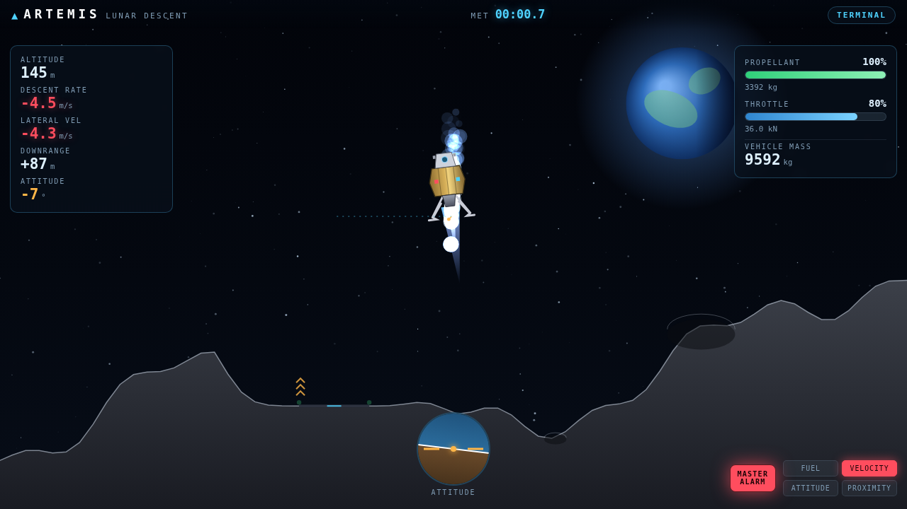

<div align="center">

# 🌖 ARTEMIS · Lunar Descent Simulator

### Pilot a NASA Artemis-inspired lander to the surface of the Moon — real physics, real fuel, real stakes.

[](https://developer.mozilla.org/docs/Web/HTML)
[](https://developer.mozilla.org/docs/Web/CSS)
[](https://developer.mozilla.org/docs/Web/JavaScript)
[](https://developer.mozilla.org/docs/Web/API/Canvas_API)
[](https://www.nasa.gov/multimedia/imagegallery/)

[](#-tech-stack)
[](#-getting-started)
[](#-tech-stack)
[](#-controls)
[](#-contributing)

<br />



</div>

---

## 📖 Overview

**Artemis** is a fully interactive Moon-landing simulator that runs entirely in the
browser. You take the controls of a NASA Artemis-inspired Human Landing System on
final approach to the lunar South Pole, throttling a descent engine and trimming
your attitude to touch down softly on the landing pad — before the propellant runs
out. The Moon's gravity is gentle but relentless, and with no atmosphere to slow
you, every metre per second counts.

It's built with **nothing but HTML, CSS, and JavaScript** — no frameworks, no
bundlers, no `node_modules`. Just open the file and fly.

---

## ✨ Features

- 🪐 **Realistic Newtonian physics** — true lunar gravity (1.62 m/s²), body-axis
  thrust, RCS attitude control with angular damping, and a **mass-varying rocket
  equation** (burning propellant lightens the vehicle and raises acceleration).
  Fixed-step integration at **120 Hz** for rock-solid stability.
- ⛽ **Finite fuel** — propellant is consumed via the Tsiolkovsky relation
  `ṁ = T / (Isp·g₀)`. Run the tanks dry and you become a free-falling brick.
- 🛰️ **Mission-control guidance HUD** — live altitude, descent & lateral rate,
  downrange distance, attitude director indicator (artificial horizon), propellant
  and throttle gauges, vehicle mass, a flight-director velocity vector, and a
  **caution-&-warning panel** with a master alarm and graded amber/red tiers.
- 🎚️ **Three mission profiles** — *Cadet*, *Commander*, and *Ace* vary fuel,
  terrain roughness, pad size, and touchdown limits.
- 🌑 **Procedural lunar terrain** — a fractal height field with a guaranteed flat,
  beacon-lit landing pad, scattered craters, and hazardous off-pad slopes.
- 🎞️ **Cinematic rendering** — auto-zooming camera, twinkling starfield, the Earth
  rendered from NASA's public-domain *Blue Marble / Apollo 17* photograph (with a
  procedural fallback), throttle-driven engine plume, RCS cold-gas puffs, regolith
  dust on approach, and a debris-and-shake crash effect.
- 🏆 **Scoring & grading** — graded on softness, accuracy, attitude, and remaining
  fuel, multiplied by difficulty. Land dead-centre and feather-soft for a
  *Precision Landing*.
- 📱 **Desktop & touch** — full keyboard controls, with on-screen buttons that
  appear automatically on touch devices.

---

## 🚀 Tech Stack

| Layer | Technology | Notes |
| --- | --- | --- |
| 🎨 **Rendering** | [HTML5 Canvas 2D API](https://developer.mozilla.org/docs/Web/API/Canvas_API) | All graphics — terrain, lander, particles, Earth — drawn procedurally each frame |
| 🧠 **Logic & physics** | Vanilla **JavaScript (ES2015+)** | Hand-rolled rigid-body integrator, terrain generator, and game loop |
| 💅 **Styling** | **CSS3** | Custom properties, gradients, `backdrop-filter`, keyframe animations for the mission-control UI |
| 🔤 **Typography** | [Google Fonts](https://fonts.google.com/) | *Orbitron* (display) + *Share Tech Mono* (telemetry) |
| 🛰️ **Imagery** | **NASA** public-domain assets | *Blue Marble / Apollo 17* Earth, with a procedural fallback |
| 🧰 **Tooling (dev)** | `python3 -m http.server`, [gstack](https://github.com/) headless browser | Local serving + automated QA / screenshots |

> **Zero runtime dependencies.** No npm install, no build step, no transpilation —
> the simulator is just static files loaded by classic `<script>` tags into a single
> shared `window.ARTEMIS` namespace.

---

## 🕹️ Controls

| Key | Action |
| :---: | --- |
| <kbd>W</kbd> / <kbd>↑</kbd> | Throttle up (main descent engine) |
| <kbd>S</kbd> / <kbd>↓</kbd> | Throttle down |
| <kbd>A</kbd> / <kbd>←</kbd> | Rotate left (RCS) |
| <kbd>D</kbd> / <kbd>→</kbd> | Rotate right (RCS) |
| <kbd>Space</kbd> | Cut throttle (abort burn) |
| <kbd>0</kbd>–<kbd>9</kbd> | Set throttle to 0–90% |
| <kbd>P</kbd> / <kbd>Esc</kbd> | Pause |
| <kbd>R</kbd> | Restart mission |

📱 On touch devices, on-screen rotate and throttle buttons appear automatically.

---

## 🎯 How to Play

1. 🔻 **Kill your descent rate early.** Gravity is gentle but relentless and there
   is no atmosphere to help you.
2. ↔️ **Null out lateral velocity** by tilting slightly toward the pad, then
   rotating back to vertical before touchdown.
3. ⛽ **Watch the propellant gauge** — the caution panel warns you (amber → red)
   before it's too late.
4. 🎯 Aim for the cyan target cross between the green beacon lights. Touch down
   **under the velocity and tilt limits** shown on the briefing screen.

---

## 🛠️ Getting Started

It's a static site — there's nothing to install. Either open the file directly:

```bash
# Clone the repo
git clone https://github.com/tblakex01/artemis-moon-lander.git
cd artemis-moon-lander/artemis-lander

# Option A — just open it
open index.html        # macOS    (use "start" on Windows, "xdg-open" on Linux)

# Option B — serve it (recommended, so NASA imagery loads without CORS issues)
python3 -m http.server 8000
# then visit http://localhost:8000
```

---

## 🧮 The Physics

The lander is a rigid body integrated with **semi-implicit Euler** at a fixed 120 Hz:

```
thrust  = throttle · maxThrust            (engine off below ~10% throttle)
ṁ       = thrust / (Isp · g₀)             (propellant burn — Tsiolkovsky)
mass    = dryMass + fuel                  (decreases as fuel burns)

aₓ      = (thrust / mass) · sin(θ)
a_y     = (thrust / mass) · cos(θ) − g_moon
```

Because `mass` shrinks as propellant burns, the same throttle yields **more**
acceleration late in the descent — a real effect lunar pilots have to anticipate.
RCS thrusters apply angular acceleration with passive damping, and touchdown is
graded against per-difficulty descent-rate, lateral-velocity, and tilt limits.

---

## 📁 Project Structure

```
artemis-lander/
├── index.html          # Markup, HUD, and screen overlays
├── css/
│   └── styles.css      # Mission-control styling
├── assets/
│   └── preview.png     # Gameplay preview
└── js/
    ├── config.js       # Physical constants, vehicle spec, difficulty profiles
    ├── utils.js        # Math helpers, seeded RNG, image loader
    ├── terrain.js      # Procedural lunar terrain + queries
    ├── physics.js      # Rigid-body lander integration
    ├── renderer.js     # Canvas: sky, Earth, terrain, lander, particles
    ├── hud.js          # Telemetry + caution/warning binding
    ├── input.js        # Keyboard + touch
    ├── game.js         # Loop, collision, landing evaluation, scoring
    └── main.js         # Bootstrap / screen wiring
```

---

## 🤝 Contributing

Issues and pull requests are welcome! Because there's no build step, contributing
is simple: edit the files, refresh the browser, and you're testing live. Keep the
zero-dependency, single-namespace style consistent with the existing modules.

---

## 🌌 Credits

- 🌍 **Earth imagery** — [NASA](https://www.nasa.gov/) (public domain): *The Blue
  Marble*, Apollo 17.
- 🚀 Inspired by NASA's **Artemis** program and the classic *Lunar Lander* arcade game.

> Built as a self-contained physics & rendering demo. Not affiliated with NASA.

<div align="center">

**Made with 🌙, a little ⛽, and a lot of Δv.**

</div>
